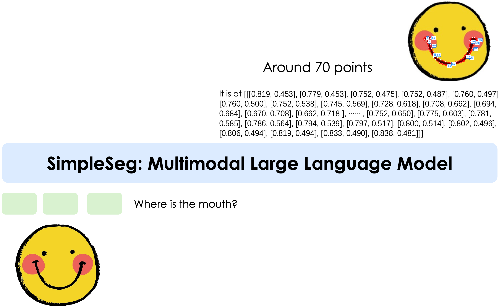

<div align="center">
<h3 align="center">
  <b>
    <span>━━━━━━━━━━━━━━━━━━━━━━━━━━━━━━━━━━━━━━━━━</span>
    <br/>
     Towards Pixel-level VLM Perception via Simple Points Prediction
    <br/>
    <span>━━━━━━━━━━━━━━━━━━━━━━━━━━━━━━━━━━━━━━━━━</span>
    <br/>
  </b>
</h3>
</div>


<div align="center">
  <a href="https://simpleseg.github.io/"><b> Homepage</b></a> | 
  <a href="https://arxiv.org/abs/2601.19228"><b> Paper</b></a>  | 
  <a href="https://huggingface.co/collections/sthui/simpleseg"><b> HuggingFace</b></a>
</div>


## 1. Introduction

We present **SimpleSeg**, **a strikingly simple yet highly effective approach to endow Multimodal Large Language Models (MLLMs) with native pixel-level perception**.
Our method reframes segmentation as a simple sequence generation problem: the model directly predicts **sequence of points** (textual coordinates) delineating object boundaries, entirely within its language space.
To achieve high fidelity, we introduce a two-stage SFT→RL training pipeline, where Reinforcement Learning with an IoU-based reward refines the point sequences to accurately match ground-truth contours. 
We find that **the standard MLLM architecture possesses a strong, inherent capacity for low-level perception** that can be unlocked without any specialized architecture.
On segmentation benchmarks, SimpleSeg achieves performance that is comparable to, and often surpasses, methods relying on complex, task-specific designs.
This work lays out that precise spatial understanding can emerge from simple point prediction, challenging the prevailing need for auxiliary components and paving the way for more unified and capable VLMs.

## 2. Method

<div align="center">
  
</div>

In this work, we explore the limits of MLLM pixel-level perception by predicting the next point in a contour with the simplest approach possible.
Without introducing any complex architectures or special patterns, we show how even minimalistic point prediction can achieve effective segmentation at the pixel level.

### Key Benefits

- **Simplicity**: SimpleSeg requires no specialized modules and adheres to the standard MLLM architecture, it can be seamlessly and efficiently integrated as a new, core pre-training task for foundation models, similar to visual grounding.
- **Task Generality**: By framing segmentation as a text-generation problem, our approach is inherently flexible. The model can be easily adapted to a wide range of vision-language tasks that require precise spatial localization.
- **Interpretable Output**: The model generates explicit, human-readable coordinate sequences instead of dense pixel masks. This transparency simplifies debugging and makes the output directly usable for downstream applications like interactive editing or tool use.

## 3. News

- [2026/01/28] We release the paper on [Arxiv](https://arxiv.org/abs/2601.19228)!
- [2026/01/27] We release two model weights of SimpleSeg on the architecture of Qwen2.5-VL and Kimi-VL!

## 4. Model Variants

We build SimpleSeg on two instantcs of VLM architectures: Qwen2.5-VL and Kimi-VL.

| **Model** | **Type** | **Total Params** | **Download Link** |
| :------------: | :------------: | :------------: | :------------: |
| Qwen2.5-VL | Dense | 7B | [🤗 Hugging Face](https://huggingface.co/sthui/SimpleSeg-Qwen2.5-VL) |
| Kimi-VL | MoE | 16B-A3B | [🤗 Hugging Face](https://huggingface.co/sthui/SimpleSeg-Kimi-VL) |


## 5. Performance

### Referring Expression Segmentation

<div align="center">

| Methods                        | refCOCO |          |          | refCOCO+ |          |          | refCOCOg |          | Avg.  |
|--------------------------------|---------|----------|----------|----------|----------|----------|----------|----------|-------|
|                                | val     | testA    | testB    | val      | testA    | testB    | val      | test     |       |
| **Decoder-based Models**       |         |          |          |          |          |          |          |          |       |
| NEXT-Chat                      | 74.7    | 78.9     | 69.5     | 65.1     | 71.9     | 56.7     | 67.0     | 67.0     | 68.9  |
| LISA                           | 74.9    | 79.1     | 72.3     | 65.1     | 70.8     | 58.1     | 67.9     | 70.6     | 69.9  |
| PixelLM                        | 73.0    | 76.5     | 68.2     | 66.3     | 71.7     | 58.3     | 69.3     | 70.5     | 69.2  |
| AnyRef                         | 76.9    | 79.9     | 74.2     | 70.3     | 73.5     | 61.8     | 70.0     | 70.7     | 72.2  |
| GSVA                           | 77.2    | 78.9     | 73.5     | 65.9     | 69.6     | 59.8     | 72.7     | 73.3     | 71.4  |
| LaSagNA                        | 76.8    | 78.7     | 73.8     | 66.4     | 70.6     | 60.1     | 70.6     | 71.9     | 71.1  |
| Groundhog                      | 78.5    | 79.9     | 75.7     | 70.5     | 75.0     | 64.9     | 74.1     | 74.6     | 74.2  |
| Text4Seg (w/ SAM)              | 79.2    | 81.7     | 75.6     | 72.8     | 77.9     | 66.5     | 74.0     | 75.3     | 75.4  |
| **Decoder-free Models**        |         |          |          |          |          |          |          |          |       |
| Text4Seg                       | 74.7    | 77.4     | 71.6     | 68.5     | 73.6     | 62.9     | 70.7     | 71.6     | 71.4  |
| **SimpleSeg**-Qwen2.5-VL       | 80.9    | 77.8     | 75.2     | 72.4     | 77.3     | 66.1     | 73.3     | 74.1     | 74.6  |
| **SimpleSeg**-Kimi-VL          | 80.0    | 80.6     | 76.2     | 70.4     | 76.2     | 67.1     | 72.8     | 74.7     | 74.8  |


</div>

### Referring Expression Comprehension

<div align="center">

| Methods          | refCOCO |          |          | refCOCO+ |          |          | refCOCOg |          | Avg.  |
|------------------|---------|----------|----------|----------|----------|----------|----------|----------|-------|
|                  | val     | testA    | testB    | val      | testA    | testB    | val      | test     |       |
| **Decoder-based Models** |             |               |               |             |               |               |              |               |      |
| LISA             | 85.4        | 88.8          | 82.6          | 74.2        | 79.5          | 68.4          | 79.3         | 80.4          | 79.8 |
| GSVA             | 86.3        | 89.2          | 83.8          | 72.8        | 78.8          | 68.0          | 81.6         | 81.8          | 80.3 |
| NEXT-Chat        | 85.5        | 90.0          | 77.9          | 77.2        | 84.5          | 68.0          | 80.1         | 79.8          | 80.4 |
| PixelLM          | 89.8        | 92.2          | 86.4          | 83.2        | 87.0          | 78.9          | 84.6         | 86.0          | 86.0 |
| Text4Seg (w/ SAM)| 90.3        | 93.4          | 87.5          | 85.2        | 89.9          | 79.5          | 85.4         | 85.4          | 87.1 |
| **Decoder-free Models** |             |               |               |             |               |               |              |               |      |
| Text4Seg         | 88.3        | 91.4          | 85.8          | 83.5        | 88.2          | 77.9          | 82.4         | 82.5          | 85.0 |
| **SimpleSeg**-Qwen2.5-VL | 90.2| 92.9          | 86.1          | 84.6        | 90.5          | 79.0          | 84.9         | 85.6          | 86.7 |
| **SimpleSeg**-Kimi-VL    | 91.3| 92.1          | 87.1          | 82.6        | 88.3          | 79.3          | 84.6         | 86.3          | 86.5 |

</div>

## 6. Example usage

### Setup

```bash
conda create -n simpleseg python=3.10 -y
conda activate simpleseg
pip install -r requirements.txt
```

> [!Note]
> It is recommended to use python=3.10, torch>=2.1.0, and transformers>=4.48.2 as the development environment.

### Inference with Hugging Face Transformers 

We introduce how to use our model at inference stage using transformers library.

```python
from PIL import Image
from transformers import AutoModelForCausalLM, AutoProcessor

model_path = "sthui/SimpleSeg-Kimi-VL"
model = AutoModelForCausalLM.from_pretrained(
    model_path,
    torch_dtype="auto",
    device_map="auto",
    trust_remote_code=True,
)

processor = AutoProcessor.from_pretrained(model_path, trust_remote_code=True)

image_path = "./figures/octopus.png"
image = Image.open(image_path)
messages = [
    {"role": "user", "content": [{"type": "image", "image": image_path}, {"type": "text", "text": "Output the polygon coordinates of octopus in the image."}]}
]
text = processor.apply_chat_template(messages, add_generation_prompt=True, return_tensors="pt")
inputs = processor(images=image, text=text, return_tensors="pt", padding=True, truncation=True).to(model.device)
generated_ids = model.generate(**inputs, max_new_tokens=512)
generated_ids_trimmed = [
    out_ids[len(in_ids) :] for in_ids, out_ids in zip(inputs.input_ids, generated_ids)
]
response = processor.batch_decode(
    generated_ids_trimmed, skip_special_tokens=True, clean_up_tokenization_spaces=False
)[0]
print(response)
```

### Decode the polygons and masks from the response string

```python
import re
import json
import numpy as np
import pycocotools.mask as mask_utils

class RegexPatterns:
    BOXED_PATTERN = r'\\boxed\{([^}]*)\}'
    BLOCK_PATTERN = r'^```$\r?\n(.*?)\r?\n^```$'

    NON_NEGATIVE_FLOAT_PATTERN = (
        r'(?:[1-9]\d*\.\d+|0\.\d+|\d+)'
    )

    BBOX_PATTERN = rf'\[\s*({NON_NEGATIVE_FLOAT_PATTERN})\s*,\s*({NON_NEGATIVE_FLOAT_PATTERN})\s*,\s*({NON_NEGATIVE_FLOAT_PATTERN})\s*,\s*({NON_NEGATIVE_FLOAT_PATTERN})\s*\]'
    POINT_PATTERN = (
        rf'\[\s*({NON_NEGATIVE_FLOAT_PATTERN})\s*,\s*({NON_NEGATIVE_FLOAT_PATTERN})\s*\]'
    )

    POLYGON_PATTERN = rf'\[\s*{POINT_PATTERN}(?:\s*,\s*{POINT_PATTERN})*\s*\]'

polygon_matches = [
    m.group(0) for m in re.finditer(RegexPatterns.POLYGON_PATTERN, response, re.DOTALL)
]
pred_polygons = []
for polygon_match in polygon_matches:
    polygon = json.loads(polygon_match)
    pred_polygons.append(polygon)

# Get image dimensions
height, width = image.size[1], image.size[0]  # PIL Image: (width, height)

pred_masks = []
for pred_polygon in pred_polygons:
    pred_polygon = np.array(pred_polygon) * np.array([width, height])
    rle = mask_utils.frPyObjects(pred_polygon.reshape((1, -1)).tolist(), height, width)
    mask = mask_utils.decode(rle)
    mask = np.sum(mask, axis=2, keepdims=True)
    pred_masks.append(mask)
pred_mask = np.sum(pred_masks, axis=0)
pred_mask = pred_mask.sum(axis=2)
pred_mask = (pred_mask > 0).astype(np.uint8)
```


## 7. Data Processing

For the data processing of contour coordinates, refer to [data/data.py](data/data.py).


## 8. Citation

```
@misc{song2026pixellevelvlmperceptionsimple,
      title={Towards Pixel-Level VLM Perception via Simple Points Prediction}, 
      author={Tianhui Song and Haoyu Lu and Hao Yang and Lin Sui and Haoning Wu and Zaida Zhou and Zhiqi Huang and Yiping Bao and Y. Charles and Xinyu Zhou and Limin Wang},
      year={2026},
      eprint={2601.19228},
      archivePrefix={arXiv},
      primaryClass={cs.CV},
      url={https://arxiv.org/abs/2601.19228}, 
}
```
